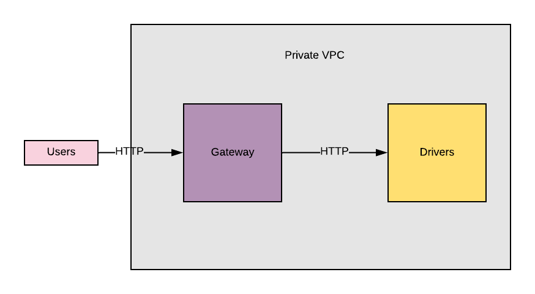

### Context



The `Gateway` service is a _public facing service_.
HTTP requests hitting this service are forwarded in HTTP to specific services.

The `Driver` service is a service that returns information about a given Driver.


### Building and executing the tests

```
make
```

### Testing services locally

```
$ make run
```

```
$ curl localhost:8080/drivers/42
{"id":42,"name":"Lynda Carr"}%
``` 

### Adding services to the api gateway

The api gateway service exposes an internal port `:8081`

Services can request to be added to the api gateway with a PUT http request - passing the encoded url of the service as the `address` field

```
> PUT /service/acme HTTP/1.1
> Host: gateway:8081
> Content-Type: application/x-www-form-urlencoded
> Accept: */*
> Content-Length: 25

| address=http%3A%2F%2Facme
```

### Viewing unified log output

```
docker-compose logs -f fluentd
```

### Viewing unified metrics output

```
docker-compose logs -f statsd
```
